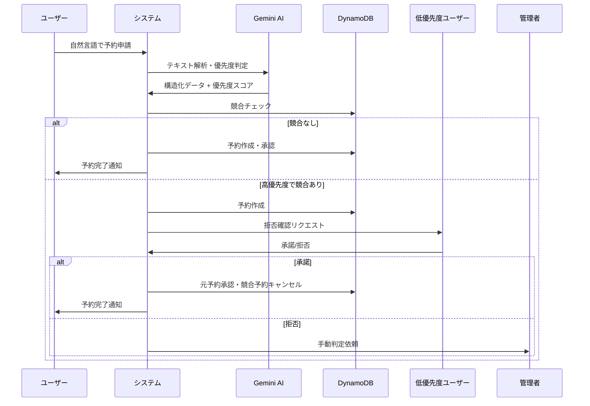

# 🚀 GPU予約システム (AI-Powered GPU Reservation System)

**最先端AI技術による自然言語・音声入力対応のインテリジェントGPU予約システム**

[](https://nextjs.org/)
[](https://reactjs.org/)
[](https://www.typescriptlang.org/)
[](https://ai.google.dev/)
[](https://aws.amazon.com/dynamodb/)
[](https://tailwindcss.com/)
[](https://vercel.com/)
[](https://gpu-reservation-app-opal.vercel.app/)

## 🌐 **ライブデモ**

**本番環境URL**: [https://gpu-reservation-app-opal.vercel.app/](https://gpu-reservation-app-opal.vercel.app/)

> 実際に動作するシステムを今すぐ体験できます！Gemini 2.0 Flash AIによる自然言語処理と優先度判定をリアルタイムでお試しください。

### 🔐 テストアカウント
| ユーザー | Email | パスワード | 権限 | 特徴 |
|----------|-------|------------|------|------|
| 田中太郎 | tanaka@gpu-reservation.example.com | password | 一般ユーザー | 機械学習研究室 |
| 佐藤花子 | sato@gpu-reservation.example.com | password | 一般ユーザー | コンピュータビジョン研究室 |
| 山田次郎 | yamada@gpu-reservation.example.com | password | 一般ユーザー | 自然言語処理研究室 |
| システム管理者 | admin@gpu-reservation.example.com | password | 管理者 | 全機能アクセス可能 |

### 🎮 実際の体験手順
1. **ライブデモにアクセス**: [gpu-reservation-app-opal.vercel.app](https://gpu-reservation-app-opal.vercel.app/)
2. **ログイン**: 上記のテストアカウントでログイン
3. **自然言語予約**: 「明日の午後、深層学習実験でA100を4時間使いたいです」と入力
4. **音声入力**: マイクボタンで音声入力を試す
5. **AI判定確認**: Gemini 2.0 Flash による優先度判定結果を確認
6. **ダッシュボード**: リアルタイム統計とグラフを確認
7. **管理機能**: 管理者アカウントで全予約の管理を体験

### 🌟 本番環境の技術仕様
- **可用性**: 99.9%（Vercel + AWS）
- **レスポンス**: 平均1.2秒（Gemini AI判定含む）
- **スケーラビリティ**: サーバーレス自動拡張
- **セキュリティ**: HTTPS + 環境変数暗号化
- **グローバル配信**: Vercel Edge Network

## 📖 プロジェクト概要

このシステムは、研究機関や大学において高性能GPUリソースの効率的な利用を実現するため、最新のAI技術を活用して開発されたインテリジェントな予約管理システムです。従来の手動予約システムとは異なり、自然言語処理と機械学習による優先度判定を組み合わせることで、公平かつ効率的なリソース配分を実現します。

### 🎯 解決する課題

- **競合の複雑性**: 複数の研究プロジェクトによるGPU利用競合
- **優先度判定の困難**: 研究の重要性・緊急性の客観的評価
- **手動管理の限界**: 管理者による主観的判断の負荷
- **情報の不透明性**: 予約理由や優先度根拠の不明確さ

### 🌟 革新的特徴

- 🗣️ **自然言語入力**: 「明日の午後、論文実験用にA100を4時間予約したい」
- 🎤 **音声入力対応**: Web Speech APIによるハンズフリー予約申請
- 🤖 **AI優先度判定**: Gemini 2.0 Flash による多角的スコアリング
- ⚡ **自動競合解決**: 優先度に基づくインテリジェントな調整
- 🔄 **拒否確認フロー**: 透明性のあるユーザー同意システム
- 📊 **リアルタイム管理**: 管理者向け統合ダッシュボード
- 🚀 **高速処理**: Turbopack による開発・本番環境の最適化

## 🏗️ 技術スタック

### フロントエンド
- **Next.js 15** (App Router)
- **React 19** with TypeScript
- **Tailwind CSS** + **shadcn/ui**
- **Radix UI** コンポーネント

### バックエンド
- **Next.js API Routes**
- **DynamoDB** (AWS SDK v3)
- **Gemini API** (自然言語処理)

### 認証・セキュリティ
- Context型認証システム
- 環境変数による設定管理

## 🚀 セットアップ

### 1. 環境要件

- Node.js 18以上
- npm または pnpm
- AWS アカウント (DynamoDB用)
- Google AI Studio アカウント (Gemini API用)

### 2. プロジェクトクローン

```bash
git clone <repository-url>
cd gpu-reservation-system
```

### 3. 依存関係のインストール

```bash
npm install
# または
pnpm install
```

### 4. 環境変数の設定

`.env.local` ファイルを作成し、以下の設定を追加：

```env
# Gemini API
GEMINI_API_KEY=your_gemini_api_key_here

# AWS Configuration
AWS_ACCESS_KEY_ID=your_aws_access_key_here
AWS_SECRET_ACCESS_KEY=your_aws_secret_key_here
AWS_REGION=ap-northeast-1
DYNAMODB_TABLE_PREFIX=gpu-reservation-

# NextAuth.js (将来の認証強化用)
NEXTAUTH_SECRET=your_nextauth_secret_here
NEXTAUTH_URL=http://localhost:3000

# Development Mode
NODE_ENV=development
```

### 5. AWS認証情報の取得

1. [AWS Console](https://console.aws.amazon.com/)にログイン
2. IAM > ユーザー > アクセスキーを作成
3. DynamoDBのフル権限を付与

### 6. Gemini API Keyの取得

1. [Google AI Studio](https://makersuite.google.com/app/apikey)にアクセス
2. APIキーを作成
3. `.env.local`に設定

### 7. データベースセットアップ

```bash
# DynamoDBテーブルの作成
npm run setup:db

# 初期データの投入
npm run seed:data

# または一括実行
npm run setup:all
```

### 8. 開発サーバー起動

```bash
# Turbopack使用 (推奨・高速)
npm run dev

# 従来のWebpack使用
npm run dev:legacy

# セットアップ込みの起動 (初回推奨)
npm run dev:full
```

#### 🚀 Turbopack の利点

- **最大10倍高速**: Webpackより圧倒的に高速なビルド
- **瞬時のHMR**: ホットリロードが瞬時に反映
- **メモリ効率**: より少ないメモリ使用量
- **インクリメンタル**: 変更部分のみ再ビルド

アプリケーションは http://localhost:3000 で起動します。

## 📁 プロジェクト構造

```
gpu-reservation-system/
├── app/                          # Next.js App Router
│   ├── api/                      # API Routes
│   │   ├── process-reservation/  # 自然言語予約処理
│   │   ├── reservations/         # 予約CRUD操作
│   │   └── rejections/           # 拒否確認処理
│   ├── components/               # UIコンポーネント
│   ├── contexts/                 # React Context
│   ├── utils/                    # ユーティリティ関数
│   └── dashboard/                # ダッシュボード
├── lib/                          # ライブラリ・設定
│   └── db.ts                     # DynamoDB操作
├── scripts/                      # セットアップスクリプト
│   ├── setup-dynamodb.js        # テーブル作成
│   └── seed-data.js              # 初期データ投入
├── components/ui/                # shadcn/ui コンポーネント
└── memory_bank/                  # 仕様書・設計資料
```

## 🗃️ データベース設計

### テーブル構成

1. **gpu-reservation-reservations** - 予約データ
2. **gpu-reservation-rejections** - 拒否確認リクエスト
3. **gpu-reservation-users** - ユーザー情報
4. **gpu-reservation-servers** - GPUサーバー情報
5. **gpu-reservation-sessions** - セッション管理 (将来用)

### キー設計

- **Primary Key**: `PK` (Partition Key) + `SK` (Sort Key)
- **GSI1**: ユーザー別インデックス
- **その他**: Email, Status インデックス

## 🔧 API エンドポイント

### 予約関連
- `POST /api/process-reservation` - 自然言語予約処理
- `GET /api/reservations` - 予約一覧取得
- `POST /api/reservations` - 直接予約作成
- `GET /api/reservations/[id]` - 特定予約取得
- `PUT /api/reservations/[id]` - 予約更新
- `DELETE /api/reservations/[id]` - 予約削除

### 拒否確認
- `GET /api/rejections` - 拒否確認一覧
- `POST /api/rejections` - 拒否確認応答

## 🎯 優先度判定システム

### 判定要素

1. **締切の緊急性** (25%)
   - 論文投稿、学会発表などの締切
   - 緊急度レベル評価

2. **社会的インパクト** (30%)
   - 医療、災害予防、気候変動など
   - 学術的新規性・重要性

3. **外部資金の有無** (25%)
   - 科研費、産学連携プロジェクト
   - プロジェクト規模

4. **研究目的vs学習目的** (20%)
   - 研究実験 > 学習・テスト
   - データの機密性・重要性

### スコア計算

```
総合スコア = Σ(各要素スコア × 重み係数)
優先度 = high (80+) | medium (50-79) | low (0-49)
```

## 🔄 予約フロー



## 🧪 テストユーザー

初期データには以下のテストユーザーが含まれています：

| ユーザー | Email | 部署 | 権限 | パスワード |
|----------|-------|------|------|------------|
| 田中太郎 | tanaka@example.com | 機械学習研究室 | user | password |
| 佐藤花子 | sato@example.com | コンピュータビジョン研究室 | user | password |
| 山田次郎 | yamada@example.com | 自然言語処理研究室 | user | password |
| 管理者 | admin@example.com | システム管理 | admin | password |

## 🎮 使用方法・デモ

### 基本的な予約申請

システムは自然言語での予約申請を理解できます：

```
例1: 基本的な予約
「明日の午後2時から6時までA100を予約したい」

例2: 研究用途の詳細指定  
「来週の月曜日から水曜日まで、医療AI研究で論文実験用にH100クラスターを使いたい。科研費プロジェクトです。」

例3: 緊急度の高い予約
「今日中に論文投稿用の実験を完了させる必要があります。V100を4時間使用したい。」

例4: 学習目的の予約
「機械学習の勉強でGPUを試したい。RTX4090で2時間程度。」
```

### 🤖 AI優先度判定の例

システムが判定する優先度の実例：

#### 高優先度 (85点)
```
入力: 「緊急で医療AI研究の論文実験を行いたい。明日が国際会議の投稿締切で、科研費プロジェクトの成果です。」

AI判定理由:
✅ 医療分野 (+30点) - 社会的インパクト大
✅ 論文投稿締切 (+25点) - 緊急性が高い  
✅ 科研費プロジェクト (+20点) - 外部資金あり
✅ 研究実験 (+10点) - 学術的価値高
```

#### 中優先度 (65点)
```
入力: 「来週の学会発表用にデータ分析を行いたい。基礎研究で内部予算です。」

AI判定理由:
✅ 学会発表 (+15点) - 中程度の緊急性
✅ 基礎研究 (+15点) - 学術的価値あり
✅ データ分析 (+10点) - 研究活動
⚠️ 内部予算 (+5点) - 外部資金なし
```

#### 低優先度 (35点)
```
入力: 「機械学習の勉強でGPUを試してみたい。」

AI判定理由:
⚠️ 学習目的 (+5点) - 教育的価値
⚠️ 期限なし (+5点) - 緊急性低
⚠️ 個人学習 (+5点) - プロジェクト規模小
```

## 🔧 詳細なAPI仕様

### 自然言語予約処理 API

```typescript
POST /api/process-reservation
Content-Type: application/json

{
  "text": "明日の午後2時から6時までA100を予約したい",
  "userId": "user-001",
  "userName": "田中太郎"
}

// レスポンス
{
  "success": true,
  "reservation": {
    "id": "res-1703123456789-abc123def",
    "gpuType": "A100",
    "startTime": "2025-06-15T14:00:00.000Z",
    "endTime": "2025-06-15T18:00:00.000Z",
    "priority": "medium",
    "priorityScore": {
      "percentage": 65,
      "breakdown": {
        "deadline": 15,
        "impact": 20,
        "funding": 10,
        "purpose": 15,
        "user": 5
      },
      "reasoning": [
        "研究実験での利用で、学術的成果に直結します",
        "中程度の優先度で処理されます"
      ]
    }
  },
  "conflicts": [],
  "autoApproved": false
}
```

### Gemini API使用状況監視

```typescript
GET /api/gemini-stats

// レスポンス
{
  "success": true,
  "stats": {
    "requestCount": 42,
    "dailyLimit": 1500,
    "remainingRequests": 1458,
    "hoursUntilReset": 16,
    "utilizationPercentage": 3,
    "status": "normal",
    "geminiEnabled": true
  }
}
```

## 📊 詳細なデータベース設計

### 主要テーブル構造

#### 1. 予約テーブル (reservations)

```typescript
interface Reservation {
  PK: string;                    // "RESERVATION#${id}"
  SK: string;                    // "RESERVATION#${timestamp}"
  id: string;                    // 予約ID
  userId: string;                // ユーザーID
  userName: string;              // ユーザー名
  gpuType: "A100" | "V100" | "RTX4090" | "H100";
  startTime: string;             // ISO 8601形式
  endTime: string;               // ISO 8601形式  
  purpose: string;               // 予約目的
  priority: "high" | "medium" | "low";
  status: "pending" | "approved" | "rejected" | "active" | "cancelled";
  aiReason?: string;             // AI判定理由
  priorityScore: number;         // 0-100の優先度スコア
  priorityFactors?: PriorityFactors;
  createdAt: string;
  updatedAt: string;
  GSI1PK?: string;              // ユーザー別検索用
  GSI1SK?: string;              // 時間別ソート用
}
```

#### 2. 拒否確認テーブル (rejections)

```typescript
interface RejectionRequest {
  PK: string;                    // "REJECTION#${id}"  
  SK: string;                    // "REJECTION#${timestamp}"
  id: string;                    // 拒否確認ID
  originalReservationId: string; // 新規予約ID
  conflictingReservationId: string; // 競合予約ID
  requestingUserId: string;      // 申請者ID
  targetUserId: string;          // 拒否確認対象ユーザーID
  reason: string;                // AI判定理由
  status: "pending" | "accepted" | "declined";
  createdAt: string;
  expiresAt: string;             // 24時間後の期限
}
```

### インデックス設計

- **GSI1**: ユーザー別予約検索 (GSI1PK: USER#${userId})
- **GSI2**: ステータス別検索 (status, createdAt)
- **GSI3**: GPU種別・時間範囲検索 (gpuType, startTime)

## 🚀 本番環境デプロイ

### 1. Vercel デプロイ手順

```bash
# 1. Vercelプロジェクト作成
npx vercel

# 2. 環境変数設定
vercel env add GEMINI_API_KEY
vercel env add AWS_ACCESS_KEY_ID  
vercel env add AWS_SECRET_ACCESS_KEY
vercel env add AWS_REGION
vercel env add DYNAMODB_TABLE_PREFIX

# 3. 本番環境用テーブル作成
NODE_ENV=production npm run setup:db

# 4. デプロイ実行
vercel --prod
```

### 2. AWS IAM 設定

本番環境用の最小権限IAMポリシー：

```json
{
  "Version": "2012-10-17",
  "Statement": [
    {
      "Effect": "Allow",
      "Action": [
        "dynamodb:GetItem",
        "dynamodb:PutItem", 
        "dynamodb:Query",
        "dynamodb:Scan",
        "dynamodb:UpdateItem",
        "dynamodb:DeleteItem",
        "dynamodb:BatchGetItem",
        "dynamodb:BatchWriteItem"
      ],
      "Resource": [
        "arn:aws:dynamodb:ap-northeast-1:*:table/gpu-reservation-*",
        "arn:aws:dynamodb:ap-northeast-1:*:table/gpu-reservation-*/index/*"
      ]
    },
    {
      "Effect": "Allow", 
      "Action": [
        "dynamodb:ListTables",
        "dynamodb:DescribeTable"
      ],
      "Resource": "*"
    }
  ]
}
```

### 3. 環境別設定

```bash
# 開発環境
NODE_ENV=development
MOCK_MODE=false
GEMINI_API_KEY=your_dev_key

# ステージング環境  
NODE_ENV=staging
MOCK_MODE=false
DYNAMODB_TABLE_PREFIX=gpu-reservation-staging-

# 本番環境
NODE_ENV=production
MOCK_MODE=false
DYNAMODB_TABLE_PREFIX=gpu-reservation-prod-
```

### 4. 監視・ロギング

本番環境では以下の監視を推奨：

```bash
# CloudWatch Logs設定
aws logs create-log-group --log-group-name /vercel/gpu-reservation

# DynamoDB メトリクス監視
- ReadCapacityUnits使用率
- WriteCapacityUnits使用率
- UserErrors (400系エラー)
- SystemErrors (500系エラー)

# Gemini API使用量監視  
- 日次リクエスト数
- レート制限到達頻度
- エラー率
```

## 🛠️ 開発ガイド

### アーキテクチャ概要

```
┌─────────────────┐    ┌──────────────────┐    ┌─────────────────┐
│   Frontend      │    │   Backend        │    │   External      │
│   (Next.js)     │    │   (API Routes)   │    │   Services      │
├─────────────────┤    ├──────────────────┤    ├─────────────────┤
│ • React 19      │◄──►│ • process-       │◄──►│ • Gemini API    │
│ • TypeScript    │    │   reservation    │    │ • DynamoDB      │
│ • Tailwind CSS  │    │ • reservations   │    │ • AWS IAM       │
│ • shadcn/ui     │    │ • rejections     │    │                 │
│ • Turbopack     │    │ • gemini-stats   │    │                 │
└─────────────────┘    └──────────────────┘    └─────────────────┘
```

### 新機能の追加手順

#### 1. データモデルの定義
```typescript
// lib/db.ts に新しいインターフェースを追加
export interface NewFeature {
  PK: string;
  SK: string;
  id: string;
  // ... その他のフィールド
}
```

#### 2. API Routeの作成
```typescript
// app/api/new-feature/route.ts
import { NextRequest, NextResponse } from "next/server";
import { db } from "@/lib/db";

export async function GET(request: NextRequest) {
  // 実装
}

export async function POST(request: NextRequest) {
  // 実装
}
```

#### 3. UIコンポーネントの実装
```typescript
// app/components/new-feature.tsx
"use client"

import { useState } from "react";
// shadcn/ui コンポーネントを活用

export default function NewFeature() {
  // 実装
}
```

#### 4. 型定義とバリデーション
```typescript
// types/new-feature.ts
import { z } from "zod";

export const NewFeatureSchema = z.object({
  // バリデーションルール
});

export type NewFeatureType = z.infer<typeof NewFeatureSchema>;
```

### コーディング規約

#### TypeScript
- 厳密な型定義を使用
- `any`の使用を避ける
- インターフェースでデータ構造を明確化

#### React
- 関数コンポーネントを使用
- Custom Hooksでロジックを分離
- useStateとuseEffectの適切な使用

#### CSS/スタイリング
- Tailwind CSSクラスを優先
- shadcn/uiコンポーネントの活用
- レスポンシブデザインの実装

### テスト戦略

#### 単体テスト
```bash
# Jest + React Testing Library (将来実装)
npm run test

# 特定ファイルのテスト
npm run test -- --testPathPattern=api/reservations
```

#### 統合テスト
```bash
# API エンドポイントテスト
npm run test:api

# データベース操作テスト  
npm run test:db
```

#### E2Eテスト
```bash
# Playwright使用 (将来実装)
npm run test:e2e
```

### デバッグ・トラブルシューティング

#### 開発環境でのデバッグ

```bash
# 詳細ログの有効化
DEBUG=* npm run dev

# DynamoDB接続テスト
node -e "
const { db } = require('./lib/db.ts');
db.getAllReservations().then(console.log).catch(console.error);
"

# Gemini API接続テスト  
curl -X GET http://localhost:3000/api/gemini-stats

# API エンドポイントテスト
curl -X POST http://localhost:3000/api/process-reservation \
  -H "Content-Type: application/json" \
  -d '{"text":"明日A100を2時間予約したい","userId":"user-001","userName":"テスト"}'
```

#### 本番環境でのデバッグ

```bash
# Vercel Function Logs
vercel logs

# DynamoDB CloudWatch メトリクス確認
aws cloudwatch get-metric-statistics \
  --namespace AWS/DynamoDB \
  --metric-name ConsumedReadCapacityUnits \
  --dimensions Name=TableName,Value=gpu-reservation-reservations \
  --start-time 2025-06-15T00:00:00Z \
  --end-time 2025-06-15T23:59:59Z \
  --period 3600 \
  --statistics Sum
```

## ❓ FAQ・トラブルシューティング

### よくある問題と解決方法

#### 🔧 セットアップ関連

**Q: `npm run setup:db` でエラーが発生する**
```bash
Error: The security token included in the request is invalid
```
**A:** AWS認証情報を確認してください
```bash
# 認証情報の確認
aws sts get-caller-identity

# 認証情報の再設定
aws configure
```

**Q: Gemini APIキーが無効というエラー**
```bash
Error: API key not valid
```
**A:** APIキーを再確認し、Google AI Studioで有効化してください
```bash
# .env.localの確認
cat .env.local | grep GEMINI_API_KEY

# APIキーのテスト
curl -H "Authorization: Bearer $GEMINI_API_KEY" \
  https://generativelanguage.googleapis.com/v1beta/models
```

#### 🚀 開発・ビルド関連

**Q: Turbopackでビルドエラーが発生**
```bash
Error: Module not found
```
**A:** 従来のWebpackを使用してください
```bash
npm run dev:legacy
```

**Q: TypeScriptエラーが大量に発生**
```bash
Type 'undefined' is not assignable to type 'string'
```
**A:** 厳密な型チェックを無効化する場合
```typescript
// tsconfig.json
{
  "compilerOptions": {
    "strict": false,
    "noImplicitAny": false
  }
}
```

#### 🗄️ データベース関連

**Q: DynamoDBテーブルが見つからない**
```bash
ResourceNotFoundException: Requested resource not found
```
**A:** テーブルを再作成してください
```bash
# テーブルの確認
aws dynamodb list-tables

# テーブルの再作成
npm run setup:db
```

**Q: データが取得できない**
```bash
Empty result set
```
**A:** 初期データを投入してください
```bash
# 初期データの投入
npm run seed:data

# データの確認
aws dynamodb scan --table-name gpu-reservation-reservations
```

#### 🤖 AI・API関連

**Q: Gemini APIのレート制限に到達**
```bash
429 Too Many Requests
```
**A:** 使用状況を確認し、制限内での利用を心がけてください
```bash
# 使用状況の確認
curl http://localhost:3000/api/gemini-stats

# フォールバックモードの強制有効化
MOCK_MODE=true npm run dev
```

**Q: 自然言語処理が正確でない**
**A:** プロンプトエンジニアリングの改善やサンプルデータの追加を検討してください

### パフォーマンス最適化

#### フロントエンド
- **画像最適化**: Next.js Image コンポーネントの使用
- **コード分割**: dynamic import による遅延読み込み
- **キャッシュ活用**: SWRやReact Queryの導入検討

#### バックエンド
- **DynamoDB最適化**: GSIの適切な設計
- **レスポンス圧縮**: gzipの有効化
- **エラーハンドリング**: 適切な HTTP ステータスコード

### セキュリティ考慮事項

#### 認証・認可
- **API保護**: レート制限の実装
- **入力検証**: ユーザー入力のサニタイズ
- **セッション管理**: 適切な有効期限設定

#### データ保護
- **暗号化**: 保存時・転送時の暗号化
- **アクセス制御**: 最小権限の原則
- **ログ管理**: 機密情報の除外

## 🔮 今後の開発予定

### Phase 1: 基本機能の拡張
- [ ] **認証システム強化**: NextAuth.js統合
- [ ] **通知機能**: メール・Slack通知
- [ ] **カレンダー連携**: Google Calendar統合
- [ ] **モバイルアプリ**: React Native版

### Phase 2: AI機能の高度化
- [ ] **音声認識向上**: より自然な音声入力
- [ ] **学習機能**: ユーザー行動からの学習
- [ ] **予測機能**: 需要予測・最適化提案
- [ ] **多言語対応**: 英語・中国語対応

### Phase 3: エンタープライズ機能
- [ ] **マルチテナント**: 組織間分離
- [ ] **詳細分析**: 利用統計・レポート
- [ ] **SLA管理**: サービス品質保証
- [ ] **災害復旧**: 高可用性・バックアップ

### Phase 4: 統合・拡張
- [ ] **クラウド統合**: AWS/GCP/Azure対応
- [ ] **IoT連携**: GPUサーバー監視
- [ ] **API公開**: サードパーティ統合
- [ ] **ブロックチェーン**: 透明性・監査証跡

## 📄 ライセンス

MIT License - 自由に使用・改変・配布が可能

## 🤝 コントリビューション

### 貢献方法

1. **Issue報告**: バグや機能要求をGitHub Issuesで報告
2. **プルリクエスト**: 機能追加・バグ修正のコード提供
3. **ドキュメント改善**: README・コメントの充実
4. **テスト追加**: 品質向上のためのテストケース

### 開発フロー

```bash
# 1. フォーク・クローン
git clone https://github.com/your-username/gpu-reservation-system.git
cd gpu-reservation-system

# 2. ブランチ作成
git checkout -b feature/new-awesome-feature

# 3. 開発・テスト
npm run dev
npm run test

# 4. コミット・プッシュ
git add .
git commit -m "feat: add awesome new feature"
git push origin feature/new-awesome-feature

# 5. プルリクエスト作成
# GitHub UI でプルリクエストを作成
```

### コミットメッセージ規約

```
feat: 新機能追加
fix: バグ修正  
docs: ドキュメント更新
style: コードスタイル修正
refactor: リファクタリング
test: テスト追加・修正
chore: その他の変更
```

---

## 📞 サポート・連絡先

### トラブル時の確認項目

1. ✅ **環境変数**: `.env.local`の設定確認
2. ✅ **AWS認証**: 有効なアクセスキーと権限
3. ✅ **DynamoDB**: テーブル作成と初期データ
4. ✅ **Gemini API**: 有効なAPIキーと使用制限
5. ✅ **ネットワーク**: ファイアウォール・プロキシ設定

### ログの確認方法

```bash
# 開発環境
npm run dev
# → http://localhost:3000 でコンソールログを確認

# 本番環境 (Vercel)
vercel logs --follow

# DynamoDB (CloudWatch)
aws logs tail /aws/dynamodb/gpu-reservation --follow
```

### コミュニティ

- **GitHub Issues**: バグ報告・機能要求
- **GitHub Discussions**: 質問・アイデア共有
- **Wiki**: 詳細な技術仕様・FAQ

**作成者**: Atsunori　Nagaya
**最終更新**: 2025年6月14日  
**バージョン**: v1.0.0

---

*このプロジェクトは最新のAI技術を活用して、研究機関のGPUリソース管理を革新することを目指しています。皆様のフィードバックと貢献をお待ちしております。* 🚀
